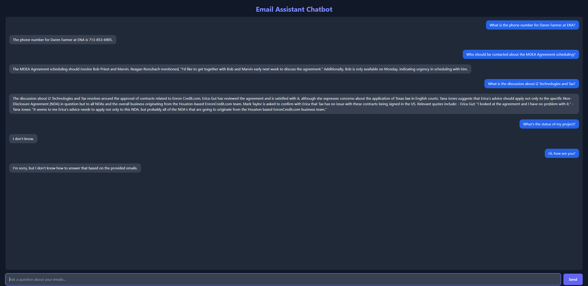

# Email Wizard's Assistant


This project implements an Email Wizard Assistant using a Retrieval-Augmented Generation (RAG) model to answer queries based on a provided email dataset.

## Task Overview & Features Implemented

1.  **GitHub Repository Setup:** This repository, structured for the project.
2.  **RAG Model Integration:**
    *   Orchestration: LangChain framework.
    *   Embedding: OpenAI `text-embedding-3-small` model.
    *   Generation: OpenAI `gpt-4o-mini` model.
3.  **Dataset Preparation:** Processing and utilization of the first 60 emails from `data/proc_email.csv`.
4.  **Embedding & Vector Storage:** Conversion of email content into vector embeddings and storage in a FAISS index for efficient retrieval.
5.  **Similarity Search:** Implementation of similarity search using the FAISS vector store to find relevant emails based on user queries.
6.  **API Implementation:** A **FastAPI** backend (`main.py`, `rag_utils.py`) exposing the RAG pipeline via a `POST /query_email` endpoint, including error handling.
7.  **Frontend Interface:** A simple, user-friendly chatbot UI (`index.html`, `script.js`, Tailwind CSS via CDN) served by FastAPI, allowing users to interact with the email assistant.
8.  **Evaluation:** Initial performance metrics (inference speed, retrieval similarity scores) captured and reported (see Evaluation Summary section).
## Project Structure
```plaintext
email-wizard-assistant-rag/
├── .git/
├── .gitignore
├── api/                  
│   ├── static/           
│   │   └── script.js
│   ├── templates/        
│   │   └── index.html
│   ├── main.py           # FastAPI application 
│   └── rag_utils.py      
├── data/                 # Dataset 
│   └── proc_email.csv
├── faiss_index/          # Persisted FAISS vector store (created by notebook)
│   ├── index.faiss
│   └── index.pkl
├── notebooks/            # Jupyter notebook for development & index creation
│   └── email_assistant_rag.ipynb
├── .env                  
├── requirements.txt      
└── README.md             
```

## Setup Instructions

1.  **Clone Repository:**
    ```bash
    git clone https://github.com/Asquarer02/email-wizard-assistant-rag.git
    cd email-wizard-assistant
    ```

2.  **Create Virtual Environment (Recommended):**
    ```bash
    python -m venv venv
    # Activate it:
    # Windows:
    venv\Scripts\activate
    # macOS/Linux:
    source venv/bin/activate
    ```

3.  **Install Dependencies:**
    ```bash
    pip install -r requirements.txt
    ```
    *(Note: Ensure you have necessary build tools if `faiss-cpu` or `faiss-gpu` requires compilation on your system.)*

4.  **Set Up Environment Variables:**
    *   Create a file named `.env` in the project root directory (i.e., inside `email-wizard-assistant/`).
    *   Add your OpenAI API key to this file. **Generate a new key if you haven't already revoked the one previously committed.**
        ```env
        OPENAI_API_KEY="sk-YourNewValidOpenAIKeyHere"
        ```
    *   Make sure this `.env` file is listed in your `.gitignore` file and is **not** committed to Git.

5.  **Generate FAISS Index (Required before running API):**
    *   You need to run the Jupyter notebook first to process the emails and create the vector store index.
    *   Start Jupyter Lab or Notebook from your project root directory:
        ```bash
        jupyter lab
        # OR
        jupyter notebook
        ```
    *   Open `notebooks/email_assistant_rag.ipynb`.
    *   Ensure the `OPENAI_API_KEY` is correctly loaded from your `.env` file within the notebook environment as well.
    *   Run all the cells in the notebook up to and including the cell that creates and saves the FAISS index (`vector_store.save_local(FAISS_INDEX_PATH)`). This will create the `faiss_index/` directory and its contents.

6.  **Run the FastAPI Application:**
    *   Make sure you are in the project root directory (`email-wizard-assistant/`) in your terminal, with your virtual environment activated.
    *   Start the FastAPI server using Uvicorn:
        ```bash
        uvicorn main:app --reload --port 5001
        ```
        *   `main`: Refers to the file `main.py`.
        *   `app`: Refers to the `app = FastAPI()` instance inside `main.py`.
        *   `--reload`: Enables auto-reload for development (restart server on code changes).
        *   `--port 5001`: Specifies the port to run on (feel free to change).
    *   The server will start, and you should see logs indicating the RAG components are loading from `rag_utils.py`.

7.  **Access the Chatbot UI:**
    *   Open your web browser and navigate to: `http://127.0.0.1:5001` (or the port you specified).
    *   You should see the chat interface. Type your queries and press Send or Enter.

## Running the Development Notebook

For development, experimentation, evaluation, or re-generating the FAISS index:

1.  Ensure steps 1-4 (Clone, Env, Install, `.env` setup) from the Setup Instructions are complete.
2.  Start Jupyter Lab or Notebook from the project root.
3.  Open and run cells in `notebooks/email_assistant_rag.ipynb`.


## Evaluation

This section details the initial performance metrics for the Email Wizard's Assistant, based on a dataset of 60 emails and a suite of 6 diverse test queries.

### 1. Search Speed (Inference Time)

*   **Individual RAG Inference Times:**
    *   Query 1 ("Daren Farmer contact?"): `2.2525` seconds
    *   Query 2 ("i2 Technologies/Tax?"): `3.7890` seconds
    *   Query 3 ("MDEA Agreement scheduling?"): `2.0473` seconds
    *   Query 4 ("Vitro/Termination agreement?"): `3.2780` seconds
    *   Query 5 ("Status of my project?"): `3.2771` seconds
    *   Query 6 ("Hi, how are you?"): `2.4133` seconds
*   **Average Full RAG Inference Time:** The system processed these 6 test queries with an average end-to-end inference time of approximately **`2.8429` seconds** (calculated from the individual times above). This includes document retrieval and response generation by the `gpt-4o-mini` model.
*   **Retrieval Times (FAISS `similarity_search_with_score` for Top-3):**
    *   Query 1: `0.9723` sec
    *   Query 2: `0.9195` sec
    *   Query 3: `1.3319` sec
    *   Query 4: `0.8194` sec
    *   Query 5: `0.6122` sec
    *   Query 6: `0.5108` sec
*   **System:** (e.g., Tested on [Your System Specs: CPU, RAM, OpenAI Model Used])

### 2. Accuracy of Similarity (Retrieval Quality)

Retrieval quality was assessed using FAISS L2 distance scores (where **lower scores indicate higher similarity/relevance**) for the Top-1 retrieved document for each test query.

*   **Top-1 Document L2 Distance Scores (per query):**
    *   Query 1 ("What is the phone number for Daren Farmer at ENA?"): **`0.6766`**
        *   *Qualitative Note:* The retrieved document was highly relevant, containing the exact phone number.
    *   Query 2 ("What is the discussion about i2 Technologies and Tax?"): **`0.9416`**
        *   *Qualitative Note:* The retrieved document was highly relevant, detailing the discussion regarding Erica's advice on EnronCredit.com contracts.
    *   Query 3 ("Who should be contacted about the MDEA Agreement scheduling?"): **`0.8944`**
        *   *Qualitative Note:* The retrieved document was relevant, identifying Bob Priest in relation to the MDEA agreement.
    *   Query 4 ("Tell me about the Vitro/Termination agreement."): **`0.8657`**
        *   *Qualitative Note:* The retrieved document mentioned the termination agreement and related personnel, providing useful context even if not the full agreement text.
    *   Query 5 ("What's the status of my project?"): **`1.4451`**
        *   *Qualitative Note:* The higher L2 score reflects the generic nature of the query. The retrieved documents were the closest syntactic matches but did not contain specific project status information (as expected from this dataset).
    *   Query 6 ("Hi, how are you?"): **`1.3443`**
        *   *Qualitative Note:* Similar to the above, the L2 score is higher as there are no direct "how are you" emails. The retrieved documents were the closest available but not semantically relevant to the greeting.

*   **Interpretation of L2 Scores:**
    *   L2 distance scores range from 0 (identical embedding) upwards. Scores below ~1.0 for specific, answerable queries (like Q1-Q4) indicate good retrieval from this small dataset. Higher scores for generic or unanswerable queries (Q5, Q6) are expected and demonstrate the system's attempt to find the nearest semantic match, even if not topically relevant.
    *   The quality of retrieval is further confirmed by the LLM's ability to utilize these top documents effectively (see Coherence section).

### 3. Coherence of Responses (LLM Generation Quality)

This was assessed qualitatively by reviewing the LLM-generated answers for the 6 test queries, considering their faithfulness to the retrieved context, relevance to the query, clarity, and fluency.

*   **Overall Assessment:** Responses were generally coherent and directly addressed the queries when relevant information was present in the retrieved documents. The system appropriately indicated when information was not available for generic or unanswerable queries.
*   **Examples of Coherent Responses:**
    *   **Query 1:** "What is the phone number for Daren Farmer at ENA?"
        *   LLM Answer: "The phone number for Daren Farmer at ENA is 713-853-6905."
        *   *Note:* This answer is directly supported by the top retrieved document (L2 Score: `0.6766`).
    *   **Query 2:** "What is the discussion about i2 Technologies and Tax?"
        *   LLM Answer: "The discussion about i2 Technologies and Tax revolves around the approval of contracts related to Enron Credit.com that are being signed in the US. Tana Jones emphasizes that Erica's advice should apply not only to the specific Non-Disclosure Agreement (NDA) but also to all NDAs and the overall business originating from the Houston-based EnronCredit.com team..."
        *   *Note:* This detailed answer accurately reflects the content of the top retrieved document (L2 Score: `0.9416`).
    *   **Query 5:** "What's the status of my project?"
        *   LLM Answer: "I don't know."
        *   *Note:* This is an appropriate and honest response, given the lack of specific project status emails in the dataset and the higher L2 score (`1.4451`) of the top retrieved document for this generic query.
*   **General Observation:** The LLM effectively utilized the context from the Top-1 (and likely Top-3) retrieved documents to formulate its answers or to determine when an answer could not be found.

---
